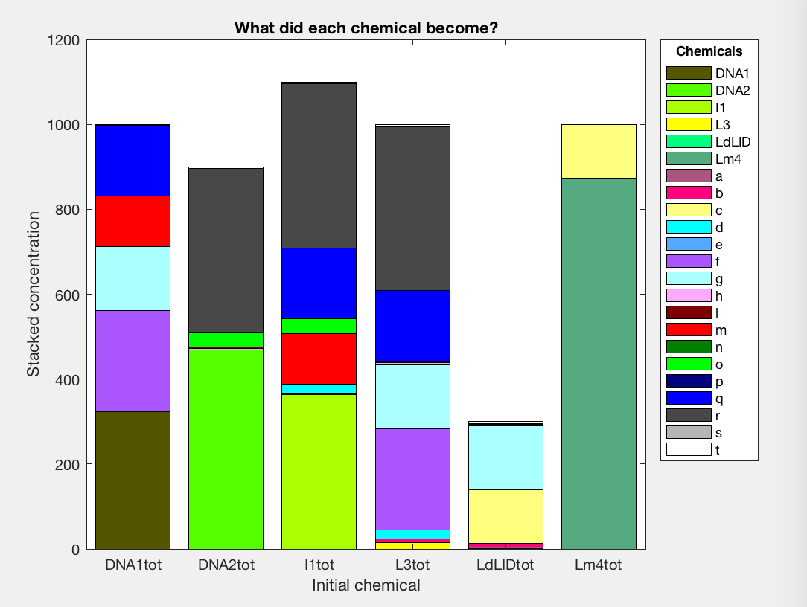
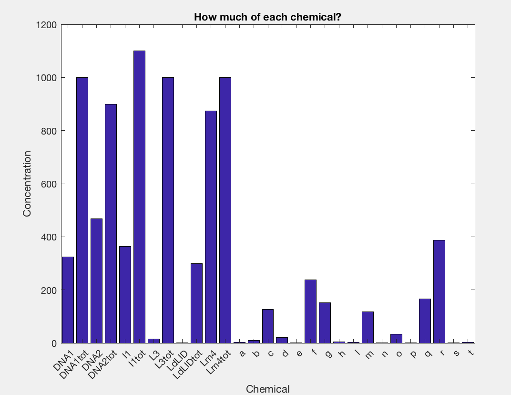

# ChemicalConcentrationMatlab
Code to work out the equilibrium concentration of some chemicals given initial concentrations and rate equations.

Running "solveConcentration.m" will produce the final concentrations and plot them in a nice graph.

If you want to change the equations for your problem, they are simplified in the Mathematica notebook "SimplifyEquations.nb" and then coded in normal form ( 0=y-f[x1,x2,...] ) into the Matlab file "rootChemicals.m"

# Example output
Stacked Concentration Graph

Bar Concentration Graph

